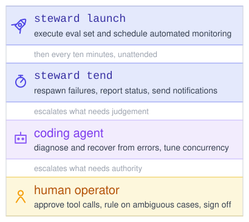
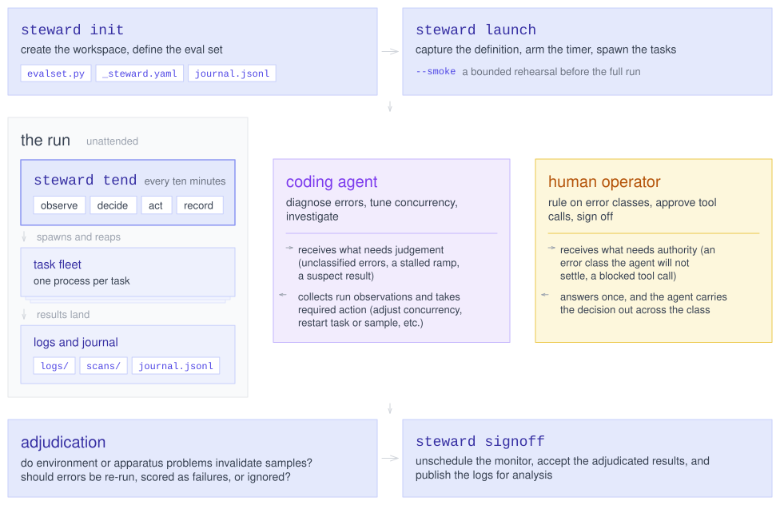

# Inspect Steward

## Overview

[](diagrams/overview.excalidraw.svg)

Inspect Steward is a system for automated execution and supervision of long-running evaluations. Steward enables you to launch a large run and walk away while a coding agent monitors it and automatically intervenes when required.

- Evaluation runs are fully unattended by design, but can escalate to humans when required.
- Opinionated defaults for error handling keep tasks running, with an agent driven workflow for error resolution and retry.
- Slack, email, or webhook notifications to keep operators apprised of status and pending decisions.
- Works with [eval_set()](https://inspect.aisi.org.uk/reference/inspect_ai.html#eval_set) as well as with execution frameworks like [Inspect Flow](https://meridianlabs-ai.github.io/inspect_flow/) and [Inspect Hawk](https://hawk.metr.org).

## Quick Tour

### Setup

First, install Steward from GitHub with:

``` bash
pip install git+https://github.com/meridianlabs-ai/inspect_steward
```

To use Steward, create a directory, switch to it, then call `steward init`:

    Terminal

``` bash
mkdir -p ~/runs/swe-evals
cd ~/runs/swe-evals
steward init
```

This will scaffold up a Steward workspace with a placeholder `evalset.py`, a `_steward.yaml` for your standing rules, and an `AGENTS.md` file that teaches the agent how to use Steward to run an evaluation. First, define your eval set:

    evalset.py

``` python
from inspect_ai import eval_set
from inspect_harbor import cais_swebenchpro, datacurve_deep_swe

eval_set(
    tasks=[cais_swebenchpro(),  datacurve_deep_swe()],
    model=["openai/gpt-5.6-sol", "anthropic/claude-opus-5"],
)
```

Steward can manage any evalution defined with a script that ends in a call to [eval_set()](https://inspect.aisi.org.uk/reference/inspect_ai.html#eval_set) or alternatively a `config.py` from [Flow](https://meridianlabs-ai.github.io/inspect_flow/) or a `hawk.yaml` from [Hawk](https://hawk.metr.org).

### Run the Eval

Next, launch your coding agent from the workspace and tell it to run the evaluation (you should typically run from a [tmux](https://github.com/tmux/tmux/wiki) detached terminal so the agent is persistent):

    Coding Agent

``` bash
───────────────────────────────────────────── swe-evals ─
❯ please run this evaluation.
─────────────────────────────────────────────────────────
```

The agent will launch all of the tasks, setup a background monitoring process, and respond to alerts that require its intervention. From here you can detach and walk away.

> **NOTE: NoteNotifications**
>
> To be notified when things require your attention, we strongly recommend you also configure a notification channel. Put it in `_steward.yaml`, or — to keep the token out of your repository — in your `.env` file:
>
> ``` ini
> STEWARD_NOTIFICATION=slack://{OAuthToken}/{ChannelID}
> ```
>
> Anything [Apprise](https://github.com/caronc/apprise) understands works: Slack, email, SMS, a webhook, or a config file naming several. It configures your workers too, so a sample waiting on your approval reaches the same place. See [Notifications](./workflow.html.md#notifications).

The run depends on neither you nor the agent staying connected. When you come back, ask how it’s going:

    Coding Agent

``` bash
───────────────────────────────────────────── swe-evals ─
❯ how is the eval going?
─────────────────────────────────────────────────────────
```

The agent reports where the run stands: per-task progress, what it resolved on its own while you were gone, and anything that is waiting on a decision from you.

### Make Decisions

Runs rarely go perfectly, and the questions that survive the agent’s own judgement come back to you. For example, the agent might prompt. you with this when you check in:

    Coding Agent

``` bash
89 samples in cais_swebenchpro failed with the same
sandbox timeout, all inside a 30-minute window last 
night. Automatic retry has already spent its attempts.

re-run them, score them as failed, or exclude them 
from scoring?

───────────────────────────────────────────── swe-evals ─
❯ re-run them, the disk issue is fixed
─────────────────────────────────────────────────────────
```

## Workflow

Steward provides a system that is fully unattended by default but which escalates for things that only the human operator can decide. The basic workflow is:

1.  Define your eval set and policies that will govern the run.

2.  Launch the eval set for unattended execution. Let standing policies and agents handle tuning and errors whenever possible.

3.  Receive notifications whenever something needs your attention mid-run and make whatever decisions are required.

4.  At the end of the run, make final judgements about how to score anomolies and then signoff the completed run.

[](diagrams/workflow.excalidraw.svg)

## Learning More

- [Workflow](./workflow.html.md) is the comprehensive guide to a Steward run: the workspace directory, launching and tending runs, agent and human decisions, and how a run ends.

- [Concurrency](./concurrency.html.md) describes the various options for tuning concurrency, including automatic ramping behavior and caps on resource utilization.

- [Error Handling](./errors.html.md) covers standing policies for error retries and resolution, including dealing with errors that are never resolved.

- [Scanners](./scanners.html.md) explains how transcripts are scanned for scoring integrity problems as the run proceeds, and what a finding asks of you.

- [Agent Runbook](./runbook.html.md) provides the full operating instructions that coding agents use to supervise and make decisions during runs.

Integrations with execution environments are covered in [Inspect Flow](./flow.html.md) and [Inspect Hawk](./hawk.html.md).
